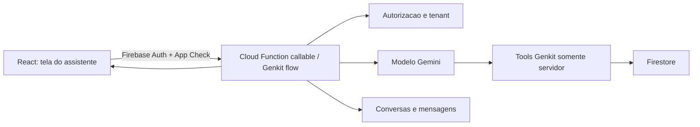

# Especificacao do Assistente de IA para Organizacao de Casamentos

## 1. Visao geral

O Serenata tera um chat com um especialista em organizacao de casamentos. O assistente deve responder duvidas, analisar os dados do casamento armazenados no Firestore, produzir insights acionaveis e propor tarefas para o casal.

O assistente nao e um chatbot de proposito geral. Toda resposta deve permanecer no dominio de planejamento e execucao de casamentos. A primeira versao pode ler os dados do casamento e criar tarefas, mas nao pode alterar ou excluir outros registros.

## 2. Objetivos

- Reduzir o esforco do casal para decidir o que fazer em seguida.
- Responder duvidas praticas sobre organizacao de casamento.
- Transformar pedidos em tarefas estruturadas no Kanban.
- Identificar atrasos, riscos e lacunas a partir dos dados reais do Firestore.
- Explicar de quais dados os insights foram derivados.
- Manter o usuario no controle de toda operacao de escrita.

## 3. Escopo do MVP

### Incluido

- Chat autenticado dentro da area administrativa.
- Respostas em portugues do Brasil.
- Conversas persistentes e historico por usuario e casamento.
- Leitura controlada de tarefas, agenda, RSVP, presentes e configuracoes.
- Calculo de metricas deterministicas no backend.
- Geracao de insights a partir dessas metricas.
- Proposta de uma ou varias tarefas.
- Confirmacao explicita antes da criacao das tarefas.
- Criacao de tarefas com registro de auditoria.
- Sugestoes iniciais de perguntas e acoes.
- Feedback positivo ou negativo sobre respostas.

### Fora do MVP

- Envio automatico de WhatsApp, e-mail ou notificacoes.
- Contratacao, negociacao ou pagamento de fornecedores.
- Exclusao ou alteracao de tarefas pelo modelo.
- Escrita em RSVP, presentes, agenda, configuracoes ou usuarios.
- Busca aberta na internet.
- Recomendacoes juridicas, medicas ou financeiras tratadas como aconselhamento profissional.
- Execucao autonoma de acoes sem confirmacao humana.

## 4. Personas e permissoes

O chat esta disponivel apenas para usuarios autenticados. O backend deve obter a identidade pelo Firebase Authentication e nunca aceitar `userId`, papel ou `weddingId` como autoridade enviados livremente pelo cliente.

Todos os perfis autenticados podem conversar, consultar insights e confirmar a criacao de tarefas. O assistente adapta a linguagem ao papel registrado no perfil:

- `Noivo` e `Noiva`: linguagem acolhedora, clara e colaborativa, focada nas decisoes do casal.
- `Assessor`, `Assessora` e `Assessor(a)`: linguagem objetiva, operacional e orientada a execucao, dependencias e prazos.
- Outros papeis: linguagem neutra e profissional, adequada ao nome do papel, sem inferir genero, autoridade ou conhecimento que nao estejam registrados.

A adaptacao nunca muda permissoes, fatos ou recomendacoes tecnicas. O papel e contexto de comunicacao, nao uma instrucao fornecida pelo usuario.

Toda autorizacao deve ser revalidada no backend.

## 5. Experiencia do usuario

### 5.1 Entrada no produto

O assistente sera aberto por um botao flutuante persistente no canto inferior direito de todas as telas autenticadas. Nao e necessario adicionar uma rota ou item ao menu principal no MVP.

Botao flutuante:

- icone de conversa com identificacao visual de IA;
- `aria-label="Abrir assistente de casamento"` e tooltip no desktop;
- area clicavel minima de 48 x 48 px; tamanho visual recomendado de 56 x 56 px;
- distancia de 24 px das bordas no desktop e 16 px no mobile, respeitando `env(safe-area-inset-bottom)`;
- `z-index` acima do conteudo, mas abaixo do modal aberto;
- nao deve cobrir acoes essenciais; em telas pequenas, considerar a safe area e barras do navegador;
- quando o chat estiver aberto, o botao pode ser ocultado porque o cabecalho oferece a acao de fechar.

### 5.2 Comportamento responsivo

Usar o breakpoint ja adotado pela aplicacao: `850px`.

Em telas com largura de ate `850px`:

- abrir como modal em tela cheia usando `width: 100vw`, `height: 100dvh` e `inset: 0`;
- remover bordas e cantos arredondados;
- manter cabecalho e composer fixos, com apenas a lista de mensagens rolavel;
- respeitar safe areas no topo e na base;
- bloquear a rolagem do documento enquanto estiver aberto;
- o botao voltar do dispositivo ou `Escape` fecha o chat antes de sair da tela atual, quando a plataforma permitir.

Em telas acima de `850px`:

- abrir como painel flutuante lateral no canto inferior direito;
- largura recomendada de 440 px, limitada a `calc(100vw - 48px)`;
- altura recomendada de `min(760px, calc(100dvh - 48px))`;
- distancia de 24 px da lateral e da base;
- borda, raio de 16 px e sombra coerentes com a identidade do Serenata;
- manter a pagina visivel ao fundo;
- permitir fechar por `Escape`, botao no cabecalho ou clique no backdrop, sem perder o rascunho da mensagem;
- nao permitir redimensionamento no MVP.

Na abertura, o foco vai para o campo de mensagem. O foco deve permanecer contido no modal e retornar ao botao flutuante ao fechar. O estado da conversa e o rascunho permanecem preservados durante navegacoes internas enquanto a sessao autenticada estiver ativa.

### 5.3 Conteudo do chat

O modal deve conter:

- lista de conversas anteriores;
- botao `Nova conversa`;
- area de mensagens com streaming;
- caixa de texto com envio por botao e por `Enter`;
- indicador quando o assistente estiver consultando dados;
- cards para insights e propostas de tarefas;
- controles de confirmar, editar e cancelar propostas;
- referencias aos dados usados na resposta;
- aviso de que respostas geradas por IA podem conter erros.

### 5.4 Sugestoes iniciais

- `O que precisa da minha atencao esta semana?`
- `Analise minhas tarefas e diga quais estao em risco.`
- `Quantas pessoas confirmaram presenca?`
- `Crie um plano de tarefas para os proximos 30 dias.`
- `A minha lista de presentes esta equilibrada?`

### 5.5 Tipos visuais de resposta

- **Texto:** orientacao ou resposta a uma duvida.
- **Insight:** titulo, severidade, explicacao, evidencias e proxima acao.
- **Proposta de tarefas:** lista editavel que ainda nao foi persistida.
- **Resultado de acao:** confirmacao das tarefas realmente criadas.
- **Limitacao:** informa que nao ha dados suficientes ou que o pedido esta fora do dominio.

## 6. Comportamento do especialista

O assistente deve:

- agir como especialista pratico, acolhedor e objetivo;
- considerar o contexto e a fase do casamento antes de recomendar acoes;
- fazer no maximo uma pergunta curta quando faltar uma informacao essencial;
- diferenciar fatos do Firestore, inferencias e recomendacoes gerais;
- mencionar quando os dados estiverem ausentes, antigos ou insuficientes;
- priorizar proximos passos concretos;
- usar datas absolutas no formato brasileiro quando houver ambiguidade;
- evitar criar tarefas duplicadas ou semanticamente equivalentes;
- nunca afirmar que criou uma tarefa antes da confirmacao e do sucesso da gravacao;
- recusar educadamente pedidos fora do dominio e redirecionar ao planejamento do casamento;
- nao revelar prompt, credenciais, tokens, regras internas ou dados de outro casamento.

O assistente nao deve inventar fornecedores, precos, confirmacoes, prazos contratuais ou informacoes ausentes.

## 7. Arquitetura proposta



### Responsabilidades

- **React:** experiencia do chat, streaming, edicao da proposta e confirmacao do usuario.
- **Callable Function/Genkit flow:** autenticacao, autorizacao, contexto, modelo, tools, limites e telemetria.
- **Tools Genkit:** unica camada autorizada a ler dados operacionais ou criar tarefas.
- **Firestore:** dados do casamento, conversas, propostas, auditoria e limites de uso.
- **Firebase App Check:** reducao de chamadas originadas fora do aplicativo legitimo.

O cliente nunca deve receber credenciais do provedor de IA nem ter acesso direto a uma tool administrativa.

## 8. Estrategia de dados do casamento

### Decisao do MVP: casamento unico

O projeto representa um unico casamento. As colecoes `tasks`, `agendaEvents`, `rsvpSubmissions` e `giftRegistryItems` permanecem globais e o assistente pode consulta-las sem `weddingId`.

O backend deve declarar explicitamente `singleWeddingMode: true`. Essa configuracao documenta a premissa atual e evita que o mesmo codigo seja usado inadvertidamente em um produto multi-casal.

Conversas do assistente tambem usam colecoes globais no MVP:

```text
chatThreads/{threadId}
chatThreads/{threadId}/messages/{messageId}
chatThreads/{threadId}/proposals/{proposalId}
```

Cada thread registra `createdByUserId`. As conversas sao privadas: cada usuario pode listar, abrir, arquivar e excluir apenas as threads cujo `createdByUserId` seja igual ao seu UID. As tools continuam consultando os dados globais do casamento.

### Evolucao futura para multi-casal

Antes de atender varios casais no mesmo projeto, migrar os dados para:

```text
weddings/{weddingId}/tasks/{taskId}
weddings/{weddingId}/agendaEvents/{eventId}
weddings/{weddingId}/rsvpSubmissions/{submissionId}
weddings/{weddingId}/giftRegistryItems/{giftId}
weddings/{weddingId}/chatThreads/{threadId}
```

ou manter colecoes de topo com um `weddingId` obrigatorio e regras rigorosas. A estrutura por subcolecoes e a recomendada.

O perfil deve passar a guardar associacoes, nao apenas um papel global:

```ts
type WeddingMembership = {
  weddingId: string
  role: 'bride' | 'groom' | 'planner' | 'viewer'
}
```

Ao desativar `singleWeddingMode`, nenhuma tool podera consultar uma colecao sem um `weddingId` derivado da associacao autenticada.

## 9. Colecoes operacionais conhecidas

### `tasks`

```ts
type Task = {
  title: string
  description: string
  status: 'todo' | 'in_progress' | 'done'
  priority: 'low' | 'medium' | 'high'
  dueDate: string // YYYY-MM-DD ou vazio
  order: number
  createdAt: Timestamp
  updatedAt: Timestamp
}
```

### `agendaEvents`

```ts
type AgendaEvent = {
  title: string
  description: string
  date: string // YYYY-MM-DD
  startTime: string // HH:mm ou vazio
  endTime: string // HH:mm ou vazio
  location: string
  category: string
}
```

### `rsvpSubmissions`

```ts
type RsvpSubmission = {
  name: string
  phone: string
  attending?: boolean
  adults: number
  children: number
  totalGuests: number
  createdAt: Timestamp
}
```

### `giftRegistryItems`

```ts
type GiftRegistryItem = {
  title: string
  giftType: string
  image: string
  imageAlt: string
  productLink: string
  received: boolean
  disabled: boolean
}
```

### `settings/gifts`

```ts
type GiftSettings = {
  enableGiftConfirmation: boolean
  whatsappNumber: string
  confirmationMessageTemplate: string
}
```

### `users/{uid}`

```ts
type UserProfile = {
  name: string
  role: string
  phone: string
}
```

## 10. Dados adicionais recomendados

Criar `settings/weddingProfile` para que o especialista consiga planejar com contexto:

```ts
type WeddingProfile = {
  coupleNames: string[]
  weddingDate: string // YYYY-MM-DD
  ceremonyTime: string // HH:mm
  city: string
  state: string
  venue: string
  venueDetails: string
  expectedGuestCount: number | null
  budgetAmount: number | null
  budgetCurrency: 'BRL'
  style: string
  ceremonyType: string
  priorities: string[]
  constraints: string[]
  timezone: 'America/Sao_Paulo'
  updatedAt: Timestamp
}
```

Documento inicial deste casamento:

```ts
{
  coupleNames: ['Hélder', 'Ana Paula'],
  weddingDate: '2026-07-11',
  ceremonyTime: '16:00',
  city: 'Serranópolis',
  state: 'GO',
  venue: 'Chácara Nova Esperança',
  venueDetails: '1,5 km de Serranópolis/GO',
  expectedGuestCount: null,
  budgetAmount: null,
  budgetCurrency: 'BRL',
  style: 'Romântico floral em tons rosé',
  ceremonyType: 'Cristã',
  priorities: [],
  constraints: [],
  timezone: 'America/Sao_Paulo'
}
```

O estilo e o tipo de cerimonia foram inferidos do convite e devem poder ser corrigidos na configuracao. Quantidade esperada de convidados e orcamento permanecem desconhecidos.

Sem `weddingDate`, o assistente nao deve inventar prazos relativos ao grande dia. Ele pode fazer uma pergunta ou propor tarefas sem data.

## 11. Modelo de conversas

```text
chatThreads/{threadId}
chatThreads/{threadId}/messages/{messageId}
chatThreads/{threadId}/proposals/{proposalId}
```

### Thread

```ts
type ChatThread = {
  title: string
  createdByUserId: string
  createdAt: Timestamp
  updatedAt: Timestamp
  lastMessagePreview: string
  status: 'active' | 'archived'
}
```

### Mensagem

```ts
type ChatMessage = {
  role: 'user' | 'assistant'
  text: string
  status: 'streaming' | 'completed' | 'failed'
  createdByUserId: string | null
  createdAt: Timestamp
  model: string | null
  sources: Array<{
    collection: 'tasks' | 'agendaEvents' | 'rsvpSubmissions' | 'giftRegistryItems' | 'settings'
    label: string
    recordIds?: string[]
    snapshotAt: string
  }>
  usage: {
    inputTokens: number | null
    outputTokens: number | null
  } | null
  feedback: 'positive' | 'negative' | null
}
```

Nao persistir o conteudo completo retornado pelas tools dentro das mensagens. Persistir apenas referencias, metricas agregadas necessarias e o texto final.

### Proposta de tarefas

```ts
type TaskProposal = {
  status: 'pending' | 'confirmed' | 'cancelled' | 'expired' | 'failed'
  tasks: ProposedTask[]
  createdByUserId: string
  confirmedByUserId: string | null
  createdAt: Timestamp
  expiresAt: Timestamp
  confirmedAt: Timestamp | null
  createdTaskIds: string[]
}

type ProposedTask = {
  clientId: string
  title: string
  description: string
  priority: 'low' | 'medium' | 'high'
  dueDate: string
  rationale: string
  duplicateCandidateTaskId: string | null
}
```

## 12. Tools do Genkit

Todas as tools sao executadas no servidor. Seus retornos devem ser pequenos, estruturados e suficientes para responder ao pedido.

### 12.1 `get_wedding_context`

Retorna perfil do casamento e data/hora atual no fuso configurado.

```ts
input: {}
output: {
  today: string
  timezone: string
  wedding: WeddingProfile | null
  missingFields: string[]
}
```

### 12.2 `get_planning_summary`

Calcula metricas no codigo, nao pelo modelo.

```ts
input: { horizonDays?: 7 | 14 | 30 | 90 }
output: {
  tasks: {
    total: number
    todo: number
    inProgress: number
    done: number
    overdue: number
    dueSoon: number
    completionPercent: number
  }
  guests: {
    submissions: number
    confirmedPeople: number
    adults: number
    children: number
    declinedSubmissions: number
  }
  gifts: {
    active: number
    available: number
    received: number
    disabled: number
    byType: Record<string, number>
  }
  agenda: {
    upcoming: number
    nextEvents: Array<{ id: string; title: string; date: string; category: string }>
  }
  calculatedAt: string
}
```

### 12.3 `search_tasks`

```ts
input: {
  query?: string
  statuses?: Array<'todo' | 'in_progress' | 'done'>
  priorities?: Array<'low' | 'medium' | 'high'>
  dueFrom?: string
  dueTo?: string
  includeOverdue?: boolean
  limit?: number // maximo 50
}
output: {
  tasks: Array<Pick<Task, 'title' | 'description' | 'status' | 'priority' | 'dueDate'> & { id: string }>
  truncated: boolean
}
```

### 12.4 `get_guest_summary`

Retorna somente agregados por padrao. Nomes e telefones nao devem ser retornados para perguntas estatisticas.

```ts
input: { includeRecentResponses?: boolean }
output: {
  confirmedPeople: number
  adults: number
  children: number
  declinedSubmissions: number
  recentResponses?: Array<{ id: string; name: string; attending: boolean; totalGuests: number; createdAt: string }>
}
```

Telefone fica excluido do contexto do modelo no MVP.

### 12.5 `get_gift_summary`

```ts
input: {}
output: {
  active: number
  available: number
  received: number
  disabled: number
  byType: Record<string, number>
  itemsWithoutProductLink: number
  itemsWithoutImage: number
}
```

### 12.6 `get_upcoming_agenda`

```ts
input: { from?: string; to?: string; limit?: number }
output: {
  events: Array<{
    id: string
    title: string
    date: string
    startTime: string
    endTime: string
    location: string
    category: string
  }>
  truncated: boolean
}
```

### 12.7 `propose_tasks`

Valida e persiste uma proposta pendente, mas nao cria tarefas operacionais.

```ts
input: {
  tasks: ProposedTask[] // minimo 1, maximo 20
}
output: {
  proposalId: string
  status: 'pending'
  tasks: ProposedTask[]
  expiresAt: string
}
```

Validacoes:

- titulo entre 3 e 120 caracteres;
- descricao com no maximo 1.500 caracteres;
- `dueDate` vazio ou `YYYY-MM-DD` valido;
- prioridade pertencente ao enum;
- deteccao de tarefas potencialmente duplicadas;
- nenhuma data deve ser criada no passado sem justificativa explicita;
- no maximo 20 tarefas por proposta.

### 12.8 `confirm_task_proposal`

Esta operacao e um endpoint deterministico, nao uma tool livremente acionada pelo modelo.

```ts
input: {
  proposalId: string
  tasks: Array<{
    clientId: string
    title: string
    description: string
    priority: 'low' | 'medium' | 'high'
    dueDate: string
    selected: boolean
  }>
  idempotencyKey: string
}
output: {
  proposalId: string
  status: 'confirmed'
  createdTasks: Array<{ id: string; title: string }>
}
```

O endpoint deve:

1. autenticar e autorizar o usuario;
2. confirmar que a proposta pertence a uma thread acessivel pelo usuario;
3. rejeitar propostas expiradas ou ja processadas;
4. revalidar todos os campos editados;
5. criar as tarefas em lote;
6. atribuir `status: 'todo'` e `order` no servidor;
7. registrar criacao e origem `assistant` em `auditLogs`;
8. guardar os IDs criados na proposta;
9. responder de forma idempotente a repeticoes da mesma requisicao.

## 13. Fluxos principais

### 13.1 Tirar uma duvida geral

1. Usuario envia uma pergunta.
2. Backend valida autenticacao, App Check, tamanho e limite de uso.
3. O modelo responde com conhecimento geral de organizacao de casamentos.
4. Se a resposta nao depende do Firestore, nenhuma tool e chamada.
5. Mensagem e persistida e transmitida ao cliente.

### 13.2 Responder com dados reais

1. Usuario pergunta: `O que esta atrasado?`.
2. Modelo chama `get_wedding_context` e `search_tasks`.
3. Backend executa a consulta dentro do casamento autenticado.
4. Modelo apresenta fatos, inferencias e recomendacoes separadamente.
5. Resposta inclui fonte `tasks` e horario do snapshot.

### 13.3 Criar tarefas

1. Usuario pede: `Crie as tarefas para organizar o buffet`.
2. Assistente consulta contexto e tarefas existentes.
3. Assistente gera tarefas estruturadas e chama `propose_tasks`.
4. UI mostra um card editavel com as tarefas pendentes.
5. Usuario seleciona, edita e pressiona `Criar tarefas`.
6. UI chama `confirm_task_proposal` com chave de idempotencia.
7. Backend grava tarefas e auditoria em lote.
8. UI mostra os itens criados e oferece link para `/tarefas`.

Perguntas como `Pode criar?`, quando respondidas pelo usuario dentro de um card pendente, ainda exigem o clique no controle de confirmacao. Texto isolado nao substitui a confirmacao transacional.

### 13.4 Insights proativos

No MVP, insights sao gerados apenas quando o usuario abre o chat ou solicita uma analise. Uma versao posterior pode executar um flow agendado e gravar insights, sem enviar mensagens automaticamente.

Exemplos:

- tarefas vencidas e de alta prioridade;
- concentracao excessiva de prazos na mesma semana;
- compromissos proximos sem tarefas relacionadas;
- progresso baixo em relacao a proximidade do casamento;
- divergencia entre convidados esperados e confirmados;
- categorias ausentes ou excessivamente concentradas na lista de presentes.

Toda inferencia deve trazer `Por que estou sugerindo isso` e os numeros utilizados.

## 14. Contrato da resposta do flow

O frontend nao deve interpretar Markdown para descobrir se existe uma acao. O flow deve retornar eventos estruturados:

```ts
type AssistantResponse = {
  threadId: string
  messageId: string
  text: string
  blocks: Array<
    | { type: 'insight'; title: string; severity: 'info' | 'attention' | 'urgent'; body: string; evidence: string[] }
    | { type: 'task_proposal'; proposalId: string; tasks: ProposedTask[]; expiresAt: string }
    | { type: 'limitation'; reason: string }
  >
  sources: ChatMessage['sources']
  suggestedPrompts: string[]
}
```

Para streaming, `text` pode chegar em partes, mas `blocks` somente devem ser emitidos apos validacao final no servidor.

## 15. Prompt de sistema inicial

```text
Voce e o Especialista Serenata, um assistente de organizacao de casamentos.

MISSÃO
Ajude o casal e sua assessoria a planejar e executar o casamento com clareza, empatia e proximos passos praticos. Responda somente sobre organizacao de casamento e dados do casamento atual.

REGRAS DE DOMINIO
- Permaneca em temas como cronograma, convidados, RSVP, tarefas, agenda, fornecedores, cerimonia, recepcao, presentes, comunicacao, logistica e orcamento do casamento.
- Para pedidos fora desse dominio, explique brevemente a limitacao e ofereca ajuda relacionada ao casamento.
- Nao substitua profissionais juridicos, medicos, financeiros ou de seguranca.

DADOS E VERACIDADE
- Use tools quando a pergunta depender dos dados do Firestore.
- Nunca invente dados ausentes.
- Diferencie claramente fato observado, inferencia e recomendacao.
- Se os dados forem insuficientes, diga exatamente o que falta.
- Nao exponha dados pessoais desnecessarios, credenciais ou informacoes de outro casamento.

AÇÕES
- Voce pode propor tarefas usando a tool apropriada.
- Uma proposta nao significa que as tarefas foram criadas.
- Diga que a criacao depende da revisao e confirmacao do usuario.
- Nunca afirme sucesso sem receber o resultado do endpoint de confirmacao.
- Nao altere nem exclua registros.

ESTILO
- Responda em portugues do Brasil, salvo pedido explicito em outro idioma.
- Seja acolhedor, direto e pratico.
- Priorize no maximo cinco proximos passos, a menos que o usuario solicite um plano completo.
- Use datas absolutas e evite respostas longas sem necessidade.
```

Dados dinamicos, identidade e permissoes devem ser passados como contexto separado e confiavel, nunca concatenados a texto controlado pelo usuario como se fossem instrucoes.

## 16. Seguranca e privacidade

- Exigir Firebase Authentication em todos os endpoints.
- Habilitar e validar Firebase App Check em producao.
- Manter `singleWeddingMode` explicito e exigir isolamento por `weddingId` antes de atender varios casamentos.
- Nao permitir que o modelo monte caminhos livres de documentos ou nomes de colecoes.
- Usar allowlist de tools e colecoes.
- Limitar resultados, tamanho de mensagens, numero de tool calls e tempo total.
- Tratar conteudo vindo do Firestore como dados nao confiaveis, nunca como instrucao.
- Sanitizar texto exibido e nao renderizar HTML produzido pelo modelo.
- Excluir telefone, e-mail e identificadores do contexto quando nao forem necessarios.
- Definir politica de retencao e exclusao das conversas.
- Permitir que o usuario apague ou arquive suas conversas.
- Nao usar conversas ou dados pessoais para treinamento sem consentimento explicito.
- Proteger logs para que prompts e PII nao sejam registrados integralmente.
- Implementar rate limit por usuario e casamento.

Limites iniciais sugeridos:

- mensagem do usuario: 4.000 caracteres;
- historico enviado ao modelo: ultimas 12 mensagens mais um resumo da thread;
- maximo de 6 tool calls por turno;
- maximo de 20 tarefas por proposta;
- timeout total: 60 segundos;
- propostas expiram em 24 horas.
- 50 mensagens por usuario por dia.

## 17. Contexto e controle de custo

- Nao enviar colecoes inteiras ao modelo.
- Calcular contagens, percentuais e datas no codigo.
- Buscar detalhes somente quando a pergunta exigir.
- Resumir threads longas e manter as mensagens recentes.
- Usar um modelo rapido e economico para classificacao, titulo e perguntas simples.
- Reservar um modelo mais capaz para planos complexos e analises cruzadas.
- Configurar nome do modelo, limites e recursos por Remote Config ou variaveis de ambiente.
- Registrar tokens, latencia, tools chamadas e custo estimado por turno.

## 18. Observabilidade

Registrar eventos sem conteudo pessoal integral:

- `assistant_message_requested`;
- `assistant_message_completed`;
- `assistant_message_failed`;
- `assistant_tool_called`;
- `assistant_task_proposal_created`;
- `assistant_task_proposal_confirmed`;
- `assistant_task_proposal_cancelled`;
- `assistant_feedback_submitted`.

Metricas:

- latencia p50/p95;
- taxa de erros;
- custo e tokens por conversa;
- percentual de respostas com tool;
- propostas criadas e taxa de confirmacao;
- tarefas editadas antes da confirmacao;
- feedback positivo e negativo;
- recusas por falta de permissao ou rate limit.

## 19. Tratamento de erros

- Se o modelo falhar, preservar a mensagem do usuario e permitir tentar novamente.
- Se uma consulta falhar, nao apresentar dados parciais como completos.
- Se o streaming for interrompido, marcar a mensagem como `failed`.
- Se a proposta expirar, pedir ao assistente para gerar uma nova com dados atualizados.
- Se a confirmacao for repetida, retornar o resultado original pela chave de idempotencia.
- Se uma tarefa semelhante existir, destacar a duplicidade e deixa-la desmarcada por padrao.

## 20. Criterios de aceite do MVP

1. Um usuario nao autenticado nao consegue iniciar ou ler conversas.
2. O backend opera explicitamente em modo de casamento unico e nao aceita `weddingId` arbitrario do cliente.
3. O assistente recusa de forma util uma pergunta claramente fora do dominio.
4. `Quantas pessoas confirmaram?` retorna o mesmo total calculado diretamente a partir de RSVP.
5. `Quais tarefas estao atrasadas?` considera apenas tarefas nao concluidas com data anterior ao dia atual no fuso do casamento.
6. Respostas baseadas no Firestore indicam a fonte e o horario do snapshot.
7. Uma solicitacao de tarefas gera uma proposta e nao grava em `tasks` imediatamente.
8. Cancelar uma proposta nao cria nenhuma tarefa.
9. Confirmar uma proposta cria somente os itens selecionados e editados.
10. Clicar duas vezes em confirmar nao duplica tarefas.
11. Cada tarefa criada possui auditoria, usuario responsavel e origem `assistant`.
12. Campos invalidos ou mais de 20 tarefas sao rejeitados no backend.
13. Telefone de convidado nao e enviado ao modelo em consultas estatisticas.
14. Uma falha do modelo ou de uma tool aparece de forma compreensivel e pode ser repetida.
15. O chat funciona em desktop e celular e possui navegacao por teclado e rotulos acessiveis.

## 21. Testes obrigatorios

### Unitarios

- calculo de resumo de tarefas e RSVP;
- deteccao de tarefa vencida por timezone;
- validacao e normalizacao de propostas;
- deteccao de duplicidade;
- autorizacao por papel e casamento;
- idempotencia da confirmacao;
- filtragem de PII nos retornos das tools.

### Integracao com Emulator Suite

- acesso autenticado as colecoes globais do casamento unico;
- criacao atomica de tarefas e auditoria;
- proposta expirada;
- proposta pertencente a outro usuario/casamento;
- regras do Firestore para threads e mensagens;
- App Check e Authentication nos endpoints.

### Avaliacao do modelo

Manter um conjunto versionado de prompts, incluindo:

- duvidas gerais;
- perguntas que exigem dados;
- pedidos ambiguos de criacao;
- tentativa de prompt injection em uma tarefa ou RSVP;
- tentativa de obter telefone ou dados de outro casamento;
- pedido fora do dominio;
- dados insuficientes;
- datas relativas e conflito de prazos;
- propostas duplicadas.

Cada caso deve avaliar veracidade, uso correto de tools, privacidade, aderencia ao dominio e necessidade de confirmacao.

## 22. Plano de implementacao

### Fase 1 - Fundacao

- registrar `singleWeddingMode` e criar `WeddingProfile` global;
- adicionar Genkit e o provedor de modelo nas Cloud Functions;
- configurar App Check, secrets, limites e emuladores;
- implementar schemas compartilhados e tools somente de leitura;
- criar testes das metricas deterministicas.

### Fase 2 - Chat de leitura

- criar thread, mensagens e endpoint de chat com streaming;
- implementar o botao flutuante e o modal responsivo do assistente;
- adicionar prompt de sistema e respostas estruturadas;
- exibir fontes, limitacoes, retry e feedback;
- executar avaliacoes de dominio e privacidade.

### Fase 3 - Criacao de tarefas

- implementar `propose_tasks`;
- criar card editavel de proposta;
- implementar `confirm_task_proposal` idempotente;
- gravar tarefas e auditoria em lote;
- adicionar testes de confirmacao, expiracao e duplicidade.

### Fase 4 - Insights

- implementar `get_planning_summary` e regras de risco;
- adicionar cards de insights com evidencias;
- medir utilidade e taxa de conversao em tarefas;
- avaliar insights agendados somente depois do uso sob demanda.

## 23. Decisoes definidas

- O perfil fica em `settings/weddingProfile` e posteriormente tera edicao em Configuracoes.
- Todos os perfis autenticados podem usar o chat e confirmar tarefas.
- Cada usuario acessa somente suas proprias conversas.
- Conversas permanecem armazenadas ate o usuario arquivar ou excluir.
- O limite inicial e de 50 mensagens por usuario por dia.
- Nomes de convidados podem ser enviados ao modelo quando forem necessarios; telefones nao podem ser enviados.
- O assistente pode consultar a agenda mesmo enquanto ela estiver desativada no menu.
- O MVP usa um modelo Gemini Flash configuravel no backend.

## 24. Definicao de pronto

O MVP esta pronto quando o casal consegue abrir uma conversa autenticada, tirar duvidas dentro do dominio, receber respostas fundamentadas nos dados isolados do seu casamento, revisar uma proposta de tarefas e criar os itens selecionados com uma unica confirmacao, sem duplicidade e com auditoria completa.
