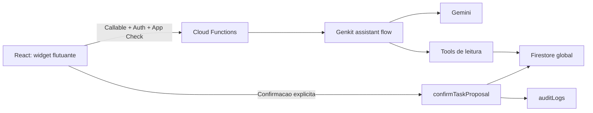

# Plano de Desenvolvimento do Assistente de IA

## 1. Decisoes adotadas

- O Firebase atende somente um casamento.
- As colecoes operacionais permanecem globais.
- O chat sera autenticado e restrito a usuarios administrativos.
- Todos os perfis autenticados podem usar o chat; a linguagem e adaptada ao papel do perfil.
- Cada usuario ve somente as proprias conversas.
- Genkit sera usado no backend para modelo, tools e acesso ao Firestore.
- Firebase AI Logic fica reservado para futuras geracoes no cliente sem dados privilegiados.
- A unica escrita permitida ao assistente no MVP e propor tarefas.
- Tarefas somente sao criadas depois da revisao e confirmacao do usuario.
- O modelo nunca grava diretamente em `tasks`.

## 2. Objetivo do MVP

Ao final do MVP, um usuario autenticado podera conversar com um especialista em casamento, consultar informacoes reais de tarefas, convidados, agenda e presentes, receber insights e transformar uma proposta revisada em tarefas do Kanban com auditoria.

## 3. Arquitetura



O projeto de Functions usa CommonJS. O MVP deve manter esse padrao ou realizar uma migracao isolada; nao deve misturar formatos de modulo dentro do mesmo fluxo.

### Backend sugerido

```text
functions/src/
  ai.js
  config.js
  schemas.js
  prompts/wedding-specialist.js
  flows/assistant-chat.js
  tools/wedding-context.js
  tools/planning-summary.js
  tools/tasks.js
  tools/guests.js
  tools/gifts.js
  tools/agenda.js
  services/authorization.js
  services/conversations.js
  services/task-proposals.js
  services/audit.js
  services/rate-limit.js
```

### Frontend sugerido

```text
src/components/assistant/AssistantWidget.tsx
src/components/assistant/AssistantDialog.tsx
src/components/assistant/AssistantSidebar.tsx
src/components/assistant/ChatMessage.tsx
src/components/assistant/ChatComposer.tsx
src/components/assistant/InsightCard.tsx
src/components/assistant/TaskProposalCard.tsx
src/lib/assistant.ts
src/types/assistant.ts
```

## 4. Convencoes

- **P0:** obrigatoria para funcionamento ou seguranca do MVP.
- **P1:** obrigatoria para uma experiencia adequada de producao.
- **P2:** melhoria posterior.
- **S/M/L:** tamanho relativo pequeno, medio ou grande.

## 5. Backlog

### Fase 0 - Ambiente e fundacao

#### AI-001 - Configurar modo de casamento unico

- **P0 / S / sem dependencia**
- Criar `singleWeddingMode: true` no backend e impedir que payloads alterem o escopo com `weddingId`.
- **Aceite:** todas as tools usam as colecoes globais conhecidas; `weddingId` enviado pelo cliente e ignorado ou rejeitado.

#### AI-002 - Configurar modelo e limites

- **P0 / S / sem dependencia**
- Configurar um modelo Gemini Flash, regiao, temperatura, tokens, timeout e ambiente sem expor segredos no frontend.
- **Aceite:** emulador e producao aceitam configuracoes distintas; ausencia de configuracao gera erro controlado.

#### AI-003 - Instalar e inicializar Genkit

- **P0 / M / depende de AI-002**
- Adicionar dependencias e inicializacao compartilhada nas Functions, preservando os endpoints administrativos existentes.
- **Aceite:** um flow protegido de diagnostico funciona localmente e as Functions atuais continuam carregando.

#### AI-004 - Configurar Authentication e App Check

- **P0 / M / depende de AI-003**
- Validar Firebase Authentication e App Check nos endpoints de IA.
- **Aceite:** chamadas anonimas ou sem App Check valido sao rejeitadas em producao; emuladores usam excecao explicita.

#### AI-005 - Criar schemas compartilhados

- **P0 / M / depende de AI-003**
- Definir schemas para mensagens, fontes, insights, propostas, tarefas e contratos das tools.
- **Aceite:** enums coincidem com `tasks`; entradas e saidas invalidas sao rejeitadas no backend.

#### AI-006 - Criar autorizacao por perfil

- **P0 / M / depende de AI-004**
- Buscar o perfil em `users/{uid}`; permitir uso e confirmacao a todos os perfis autenticados e expor o papel confiavel para adaptacao de linguagem.
- **Aceite:** identidade e papel enviados no payload nao concedem permissao; acesso negado retorna `permission-denied`.

#### AI-007 - Criar perfil do casamento

- **P0 / M / depende de AI-005**
- **Estado:** perfil inicial criado no Firestore em 19/06/2026; a tela de edicao permanece pendente.
- Criar `settings/weddingProfile` para Hélder e Ana Paula, em 11/07/2026 as 16:00, na Chácara Nova Esperança em Serranópolis/GO. Convidados esperados e orcamento iniciam como `null`.
- **Aceite:** campos ausentes sao indicados; o assistente nao inventa prazos relativos quando `weddingDate` estiver vazio.

**Marco da fase:** Genkit executa localmente com autenticacao e contexto basico.

### Fase 1 - Tools e dados reais

#### AI-008 - Implementar `get_wedding_context`

- **P0 / S / depende de AI-006 e AI-007**
- Retornar perfil, data atual, timezone e campos ausentes.
- **Aceite:** nao retorna credenciais, usuarios ou configuracoes tecnicas.

#### AI-009 - Implementar `get_planning_summary`

- **P0 / M / depende de AI-005 e AI-006**
- Calcular no codigo contagens de tarefas, RSVP, presentes e agenda.
- **Aceite:** totais coincidem com o Firestore; tarefas vencidas usam `America/Sao_Paulo`; o modelo nao calcula metricas primarias.

#### AI-010 - Implementar `search_tasks`

- **P0 / M / depende de AI-005 e AI-006**
- Consultar tarefas por texto, status, prioridade, prazo e atraso, com limite de 50.
- **Aceite:** retorno indica truncamento e a tool nao possui operacao de escrita.

#### AI-011 - Implementar `get_guest_summary`

- **P0 / M / depende de AI-005 e AI-006**
- Retornar agregados de confirmados, adultos, criancas e recusas.
- **Aceite:** telefone nao e enviado ao modelo; nomes aparecem apenas quando a pergunta exigir respostas recentes.

#### AI-012 - Implementar tools de presentes e agenda

- **P0 / M / depende de AI-005 e AI-006**
- Criar `get_gift_summary` e `get_upcoming_agenda` com limites e filtros.
- **Aceite:** respostas incluem horario do snapshot e nao carregam colecoes inteiras sem necessidade.

#### AI-013 - Testar tools no Emulator Suite

- **P0 / M / depende de AI-008 a AI-012**
- Cobrir autorizacao, filtros, metricas, timezone, ausencia de dados e falhas de consulta.
- **Aceite:** suite roda sem dados de producao e valida todos os contratos.

**Marco da fase:** backend responde perguntas deterministicas sobre os dados do casamento.

### Fase 2 - Conversa com o especialista

#### AI-014 - Implementar prompt de sistema

- **P0 / M / depende de AI-005**
- Versionar prompt com dominio, estilo, privacidade, uso de tools e limites de acao.
- **Aceite:** o assistente recusa temas fora do dominio, nao inventa dados e diferencia fatos, inferencias e recomendacoes.

#### AI-015 - Persistir threads e mensagens

- **P0 / L / depende de AI-006**
- Criar `chatThreads` e subcolecao `messages`, com autor, status, fontes, modelo e timestamps.
- **Aceite:** cada usuario acessa somente threads cujo `createdByUserId` seja seu UID; falhas ficam marcadas sem simular sucesso.

#### AI-016 - Implementar flow `assistantChat`

- **P0 / L / depende de AI-008 a AI-015**
- Integrar modelo, prompt, tools, resposta estruturada, persistencia e tratamento de erro.
- **Aceite:** responde duvidas gerais e consultas do Firestore; blocos fora do schema nao chegam ao cliente.

#### AI-017 - Implementar streaming e retry

- **P1 / M / depende de AI-016**
- Transmitir texto progressivamente; emitir blocos estruturados apenas apos validacao final.
- **Aceite:** interrupcao marca falha; retry nao duplica a mensagem do usuario.

#### AI-018 - Implementar memoria controlada

- **P1 / M / depende de AI-015 e AI-016**
- Enviar as ultimas 12 mensagens e um resumo de threads longas.
- **Aceite:** contexto nao cresce indefinidamente e resumos nao recebem autoridade de prompt de sistema.

#### AI-019 - Incluir fontes e evidencias

- **P0 / M / depende de AI-016**
- Anexar colecao, rotulo, IDs apropriados e horario do snapshot.
- **Aceite:** toda afirmacao baseada no Firestore apresenta fonte; recomendacao geral nao finge ser dado real.

**Marco da fase:** o usuario conversa com o especialista e recebe respostas fundamentadas.

### Fase 3 - Propostas e criacao de tarefas

#### AI-020 - Gerar tarefas estruturadas

- **P0 / M / depende de AI-010 e AI-016**
- Gerar de 1 a 20 tarefas com titulo, descricao, prioridade, prazo e justificativa.
- **Aceite:** datas e enums sao validos; uma data desconhecida fica vazia em vez de ser inventada.

#### AI-021 - Detectar tarefas duplicadas

- **P0 / M / depende de AI-010 e AI-020**
- Comparar propostas com tarefas abertas por normalizacao textual e, se necessario, similaridade semantica.
- **Aceite:** duplicatas provaveis exibem a tarefa existente e ficam desmarcadas por padrao.

#### AI-022 - Persistir propostas pendentes

- **P0 / M / depende de AI-015 e AI-020**
- Criar `chatThreads/{threadId}/proposals` com autor, itens, status e expiracao em 24 horas.
- **Aceite:** persistir a proposta nao cria nenhum documento em `tasks`.

#### AI-023 - Implementar `confirmTaskProposal`

- **P0 / L / depende de AI-006 e AI-022**
- Criar endpoint deterministico, separado do modelo, que revalida proposta e itens editados.
- **Aceite:** somente itens selecionados e validos sao criados; proposta expirada ou inacessivel e rejeitada.

#### AI-024 - Garantir idempotencia e atomicidade

- **P0 / M / depende de AI-023**
- Usar `idempotencyKey` e batch/transaction para proposta, tarefas e auditoria.
- **Aceite:** duplo clique retorna os mesmos IDs sem duplicar tarefas; falha nao deixa estado parcial.

#### AI-025 - Registrar auditoria da IA

- **P0 / M / depende de AI-023**
- Registrar usuario confirmador, origem `assistant`, thread, proposta e campos criados.
- **Aceite:** toda tarefa criada pode ser rastreada ate a confirmacao humana.

#### AI-026 - Testar fluxo transacional

- **P0 / L / depende de AI-021 a AI-025**
- Cobrir edicao, selecao, expiracao, permissao, repeticao, duplicidade e rollback.
- **Aceite:** todos os cenarios passam no Emulator Suite.

**Marco da fase:** uma proposta revisada vira tarefas reais exatamente uma vez.

### Fase 4 - Interface

#### AI-027 - Adicionar botao flutuante e container responsivo

- **P0 / M / sem dependencia**
- Montar `AssistantWidget` uma unica vez dentro da area autenticada e exibir um botao flutuante em todas as telas.
- **Aceite:** botao possui area minima de 48 x 48 px, tooltip e nome acessivel; fica a 24 px das bordas no desktop e 16 px no mobile; nao aparece na tela de login.

#### AI-028 - Criar layout e estado inicial

- **P0 / M / depende de AI-027**
- Criar o modal, lista de conversas, nova conversa, estado vazio e sugestoes iniciais.
- **Aceite:** ate 850 px o modal ocupa `100vw` x `100dvh`; acima de 850 px vira painel lateral de 440 px por no maximo 760 px, a 24 px da lateral e da base.

#### AI-029 - Criar composer e mensagens

- **P0 / L / depende de AI-016 a AI-018 e AI-028**
- Integrar envio, streaming, loading, cancelamento, retry e erros.
- **Aceite:** Enter envia, Shift+Enter quebra linha e HTML do modelo nao e executado.

#### AI-030 - Criar cards de insights e fontes

- **P1 / M / depende de AI-019 e AI-029**
- Exibir severidade, evidencias, fonte e data do snapshot.
- **Aceite:** usuario distingue observacao dos dados de recomendacao da IA.

#### AI-031 - Criar card editavel de proposta

- **P0 / L / depende de AI-022 e AI-029**
- Permitir selecionar, editar, confirmar e cancelar tarefas.
- **Aceite:** receber o card nao cria tarefas; duplicatas aparecem desmarcadas.

#### AI-032 - Integrar confirmacao e resultado

- **P0 / M / depende de AI-023, AI-024 e AI-031**
- Chamar endpoint com idempotencia, bloquear duplo clique e mostrar tarefas criadas.
- **Aceite:** sucesso oferece link para `/tarefas`; erro preserva edicoes e permite retry seguro.

#### AI-033 - Implementar historico e arquivamento

- **P1 / M / depende de AI-015 e AI-028**
- Listar, abrir, nomear e arquivar threads.
- **Aceite:** threads sao ordenadas por atividade e arquivadas saem da lista principal.

#### AI-034 - Validar responsividade e acessibilidade

- **P0 / M / depende de AI-028 a AI-033**
- Implementar focus trap, retorno de foco, `Escape`, labels, anuncios de streaming, contraste, safe areas e bloqueio de scroll no mobile.
- **Aceite:** fluxo completo funciona por teclado; em viewport de 360 px o modal e tela cheia; no desktop a pagina permanece visivel atras do painel; fechar e reabrir preserva o rascunho.

**Marco da fase:** toda a jornada funciona dentro do painel Serenata.

### Fase 5 - Producao

#### AI-035 - Criar regras do Firestore

- **P0 / M / depende de AI-015 e AI-022**
- Proteger threads, mensagens e propostas; escritas sensiveis ficam somente no backend.
- **Aceite:** cliente nao consegue forjar mensagem de assistente nem confirmar proposta diretamente no Firestore.

#### AI-036 - Implementar rate limit e cotas

- **P0 / M / depende de AI-016**
- Limitar a 50 mensagens por usuario por dia, alem dos limites de caracteres e tool calls.
- **Aceite:** abuso nao chama o modelo e retorna erro compreensivel; limites sao configuraveis.

#### AI-037 - Implementar observabilidade

- **P1 / M / depende de AI-016 e AI-023**
- Registrar correlation ID, latencia, erros, tokens, tools e confirmacoes sem PII integral.
- **Aceite:** logs nao armazenam telefones nem prompts completos por padrao.

#### AI-038 - Criar avaliacoes do modelo

- **P0 / L / depende de AI-014, AI-016 e AI-020**
- Testar duvidas, dados, tarefas, falta de informacao, fora de dominio e prompt injection.
- **Aceite:** cada caso avalia veracidade, dominio, privacidade, tool correta e confirmacao humana.

#### AI-039 - Executar testes end-to-end

- **P0 / L / depende de AI-026, AI-034 e AI-035**
- Testar conversa, insight, proposta, edicao, confirmacao, retry e acesso negado.
- **Aceite:** fluxo principal passa em desktop e mobile usando emuladores.

#### AI-040 - Validar custo e desempenho

- **P1 / M / depende de AI-037 e AI-038**
- Medir tokens e latencia p50/p95; ajustar modelo, memoria e resultados das tools.
- **Aceite:** metas de custo e desempenho sao aprovadas ou documentadas antes do deploy.

#### AI-041 - Preparar rollout controlado

- **P0 / M / depende de AI-035 a AI-040**
- Criar feature flag, alertas, rollback e liberacao inicial para usuarios selecionados.
- **Aceite:** o chat pode ser desligado sem novo deploy e sem afetar os demais modulos.

#### AI-042 - Documentar operacao e privacidade

- **P1 / S / depende de AI-037 e AI-041**
- Documentar retencao, exclusao de conversa, incidentes e aviso de uso de IA.
- **Aceite:** a equipe sabe desativar o recurso, investigar erros e remover historico.

**Marco da fase:** assistente testado, observavel e liberado de forma controlada.

## 6. Ordem recomendada

### Ciclo 1 - Backend de leitura

`AI-001` a `AI-013`.

### Ciclo 2 - Chat funcional

`AI-014` a `AI-019`, `AI-027`, `AI-028` e `AI-029`.

### Ciclo 3 - Criacao segura de tarefas

`AI-020` a `AI-026`, `AI-031` e `AI-032`.

### Ciclo 4 - Producao

`AI-030`, `AI-033` a `AI-042`.

## 7. Caminho critico

```text
AI-002 -> AI-003 -> AI-005 -> AI-006 -> AI-010 -> AI-016
                                               -> AI-020 -> AI-022 -> AI-023 -> AI-024 -> AI-032
```

`AI-027` e `AI-028` podem comecar em paralelo. A integracao real depende de `AI-016` e `AI-023`.

## 8. Definicao de pronto

O MVP esta concluido quando todas as tarefas P0 estiverem prontas, os testes de emulador e end-to-end passarem, o chat responder com dados coerentes do Firestore e uma proposta confirmada criar exatamente as tarefas selecionadas, sem duplicidade e com auditoria.

## 9. Melhorias posteriores

- insights proativos e notificacoes;
- criacao de compromissos na agenda;
- geracao de mensagens de WhatsApp;
- importacao inteligente de convidados;
- analise de orcamento e fornecedores;
- atualizacao de tarefas com confirmacao;
- suporte a varios casamentos com `weddingId`;
- uso de Firebase AI Logic em recursos sem dados privilegiados.
